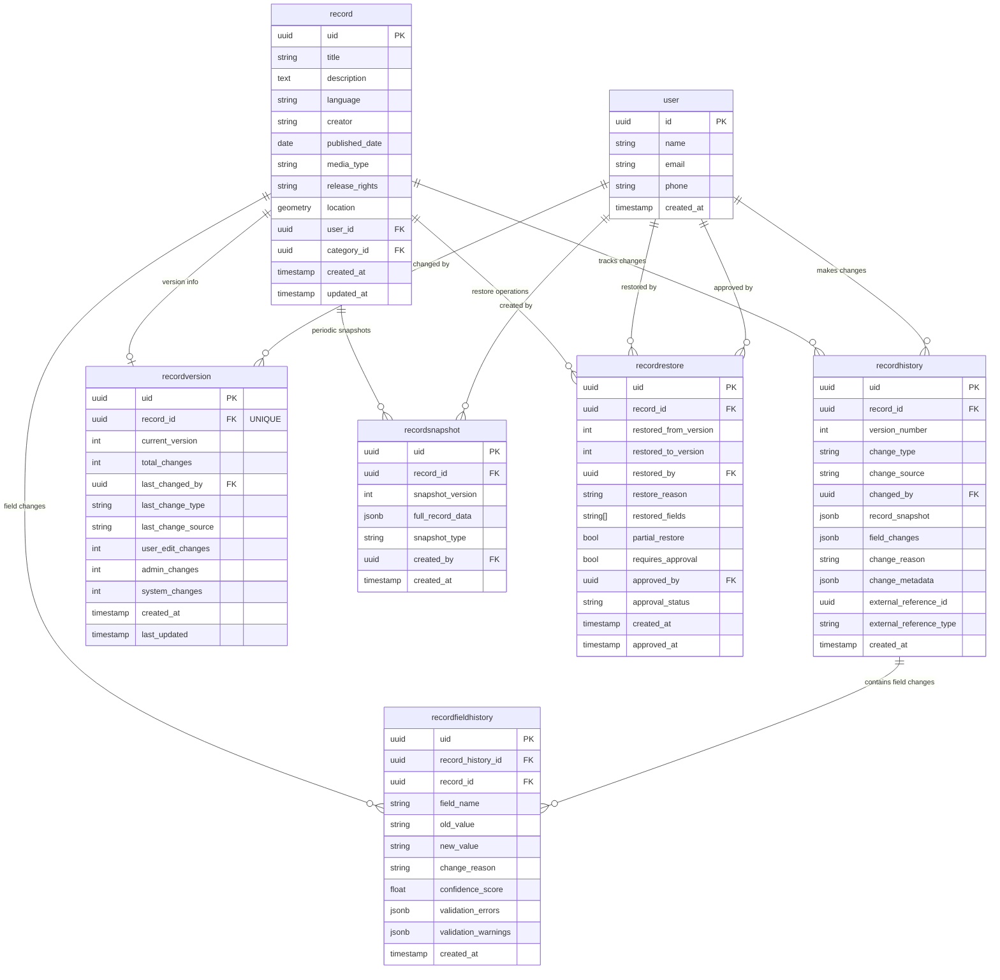

# Record History Tracking System

## Overview

The Record History Tracking system automatically captures and stores complete change history for all record modifications made through the PATCH endpoint. Every time a user updates a record, the system creates a versioned snapshot with detailed field-level change tracking.

## Complete Implementation Overview

### 🎯 **What's Been Added**

#### 1. **Complete Data Models** (`app/models/record_history.py`)
- **RecordHistory** - Full versioning with snapshots of entire record state
- **RecordFieldHistory** - Granular field-level change tracking
- **RecordVersion** - Lightweight version tracking and statistics
- **RecordSnapshot** - Periodic snapshots for efficient diff calculations
- **RecordRestore** - Rollback/restore operations with approval workflow

#### 2. **Enhanced PATCH Endpoint** (`app/api/v1/endpoints/records.py`)
- **Before/After State Capture** - Records original and new values
- **Automatic History Creation** - Every PATCH creates a versioned history entry
- **PostGIS Location Handling** - Properly tracks coordinate changes
- **Error Resilience** - History failures don't break record updates

#### 3. **History Management Service** (`app/services/record_history_service.py`)
- **Smart Change Detection** - Only tracks actual field changes
- **Version Management** - Auto-incrementing versions with statistics
- **Diff Calculations** - Compare any two versions
- **Restore Operations** - Rollback to previous versions with approval workflow
- **Snapshot Management** - Periodic snapshots for performance

#### 4. **Comprehensive API** (`app/api/v1/endpoints/record_history.py`)
- **History Retrieval** - `GET /history/record/{id}/history`
- **Version Details** - `GET /history/record/{id}/version/{version}`
- **Version Comparison** - `GET /history/record/{id}/diff?from=1&to=3`
- **Field History** - `GET /history/record/{id}/field/{field_name}/history`
- **Restore Operations** - `POST /history/record/{id}/restore`
- **Admin Approvals** - `POST /history/restore/{id}/approve`
- **Analytics** - Change activity and field-level analytics

#### 5. **Database Migration** (`alembic/versions/add_record_history_tables.py`)
- **5 New Tables** with proper indexes and constraints
- **JSONB Storage** for efficient snapshot and metadata storage
- **Foreign Key Relationships** to users and records
- **Performance Indexes** for common query patterns

### 🔄 **Extensible Architecture**

The history system is designed for extensibility and future integrations:

- **Multiple Change Sources** - Support for user edits, admin actions, and system processes
- **External References** - Flexible linking to external systems or workflows
- **Metadata Storage** - JSONB fields for custom context and integration data
- **Audit Trail Foundation** - Complete framework for accountability and compliance

## Key Features

### 🎯 **Automatic Change Capture**
- **Zero Configuration** - History tracking is automatically enabled for all record PATCH operations
- **Complete Audit Trail** - Every change is captured with user attribution and timestamps
- **Field-Level Granularity** - Individual field changes tracked separately
- **Before/After States** - Full snapshots of record state before and after changes

### 📊 **Version Management**
```bash
# Get all history for a record
GET /api/v1/history/record/{record_id}/history

# Compare versions
GET /api/v1/history/record/{record_id}/diff?from_version=1&to_version=3

# Get specific version
GET /api/v1/history/record/{record_id}/version/2
```

### 🔍 **Field-Level Tracking**
```bash
# Track changes to specific fields
GET /api/v1/history/record/{record_id}/field/language/history

# See who changed what when
GET /api/v1/history/analytics/field-changes
```

### 🔄 **Restore Operations**
```bash
# Restore to previous version (admin/reviewer only)
POST /api/v1/history/record/{record_id}/restore
{
    "target_version": 2,
    "restore_reason": "Reverting incorrect changes",
    "fields_to_restore": ["language", "title"],  // Optional: partial restore
    "requires_approval": true
}
```

### 🛡️ **Security & Permissions**

#### Permission Changes in This Update

This commit introduces significant permission changes to enable collaborative editing:

**🔄 CHANGED: Record Editing Permissions**
- **Previous**: Only the record owner could edit their own records via PATCH
- **New**: Any authenticated user can modify any record via PATCH
- **Rationale**: Enables collaborative, wiki-style editing while maintaining full audit trails

**🔄 CHANGED: History Viewing Permissions**
- **Previous**: Users could only view history of their own records (or admin/reviewer role required)
- **New**: Any authenticated user can view history of any record
- **Rationale**: Promotes transparency and allows users to see all changes made to records

**🔄 ENHANCED: Audit Trail Tracking**
- **New**: Every edit now captured with complete user attribution and timestamps
- **New**: Full before/after state snapshots for every PATCH operation
- **New**: Field-level change tracking with old and new values

#### Current Permission Matrix

| Operation | Authentication Required | Additional Role Required | Notes |
|-----------|------------------------|-------------------------|-------|
| **View Record History** | ✅ Any User | ❌ None | Complete transparency |
| **Edit Any Record (PATCH)** | ✅ Any User | ❌ None | Wiki-style collaborative editing |
| **View Version Details** | ✅ Any User | ❌ None | Access to specific versions |
| **Compare Versions** | ✅ Any User | ❌ None | Diff between any two versions |
| **View Field History** | ✅ Any User | ❌ None | Track changes to specific fields |
| **Restore Previous Version** | ✅ Any User | ✅ Admin/Reviewer | Rollback capability |
| **Approve Restore Operations** | ✅ Any User | ✅ Admin Only | Final approval for restores |
| **Access Analytics** | ✅ Any User | ✅ Admin/Reviewer | System-wide change analytics |

#### Security Safeguards

- **Complete Audit Trail** - Every change tracked for accountability
- **User Attribution** - All edits linked to the authenticated user who made them
- **Immutable History** - Past versions cannot be modified or deleted
- **Role-Based Restore Control** - Only privileged users can rollback changes
- **Change Reason Tracking** - Optional context for why changes were made

### ⚡ **Performance Optimizations**
- **Efficient Indexes** - Optimized for common query patterns
- **JSONB Storage** - Fast JSON operations for snapshots and metadata
- **Periodic Snapshots** - Reduce diff calculation overhead
- **Composite Indexes** - Multi-column indexes for complex queries

### 📈 **Analytics & Monitoring**
```bash
# Change activity analytics
GET /api/v1/history/analytics/change-activity?days=30

# Field-level change patterns
GET /api/v1/history/analytics/field-changes?days=30

# Most active users and records
GET /api/v1/history/pending-restores
```

### 🔍 **Smart Change Detection**
- **Only Real Changes** - System only creates history entries for actual field modifications
- **Value Comparison** - Intelligent comparison handles different data types
- **Location Tracking** - Special handling for PostGIS coordinate changes

## How It Works

### 1. PATCH Request Processing

When a user makes a PATCH request to `/api/v1/records/{record_id}`:

```python
# 1. Capture original state
original_values = capture_current_record_state(record)

# 2. Apply validated changes
apply_patch_changes(record, validated_data)

# 3. Capture new state
new_values = capture_current_record_state(record)

# 4. Create history entry (if changes detected)
history_service.capture_record_changes(
    record_id=record.uid,
    old_values=original_values,
    new_values=new_values,
    changed_by=current_user.id,
    change_source=ChangeSource.user_edit
)
```

### 2. History Entry Creation

For each PATCH operation that results in actual changes:

- **RecordHistory** entry created with:
  - Version number (auto-incremented)
  - Complete record snapshot
  - Field-level change details
  - User attribution and timestamps
  - Change reason and metadata

- **RecordFieldHistory** entries for each changed field:
  - Field name and old/new values
  - Change type (added/updated/removed)
  - Optional change reasoning

- **RecordVersion** tracking updated:
  - Current version incremented
  - Change counters updated
  - Last changed user/timestamp recorded

### 3. Change Detection Logic

The system intelligently detects changes by:

```python
def _calculate_field_changes(old_values, new_values):
    changes = {}

    # Check each field in new values
    for field, new_value in new_values.items():
        old_value = old_values.get(field)

        if str(old_value) != str(new_value):
            changes[field] = {
                "old_value": str(old_value) if old_value else None,
                "new_value": str(new_value) if new_value else None,
                "change_type": "updated" if old_value else "added"
            }

    # Check for removed fields
    for field, old_value in old_values.items():
        if field not in new_values:
            changes[field] = {
                "old_value": str(old_value),
                "new_value": None,
                "change_type": "removed"
            }

    return changes
```

## Database Schema

### Schema Diagram

The record history tracking system introduces 5 new tables that work together to provide comprehensive change tracking:



### Key Relationships

1. **Record → RecordHistory** (1:N): Each record can have multiple history entries representing different versions
2. **Record → RecordVersion** (1:1): Each record has exactly one version tracking record
3. **RecordHistory → RecordFieldHistory** (1:N): Each history entry can have multiple field-level changes
4. **User → RecordHistory** (1:N): Users are attributed to their changes
5. **Record → RecordSnapshot** (1:N): Periodic snapshots for efficient diff calculations
6. **Record → RecordRestore** (1:N): Track restore/rollback operations

### Table Details

### RecordHistory Table
```sql
CREATE TABLE recordhistory (
    uid UUID PRIMARY KEY,
    record_id UUID REFERENCES record(uid),
    version_number INTEGER NOT NULL,
    change_type VARCHAR(20) NOT NULL,  -- 'updated', 'created', etc.
    change_source VARCHAR(20) NOT NULL,  -- 'user_edit', 'admin_action', etc.
    changed_by UUID REFERENCES user(id),
    record_snapshot JSONB NOT NULL,  -- Complete record state
    field_changes JSONB NOT NULL,    -- Field-level changes
    change_reason VARCHAR(500),
    change_metadata JSONB,
    created_at TIMESTAMP WITH TIME ZONE NOT NULL
);
```

### RecordFieldHistory Table
```sql
CREATE TABLE recordfieldhistory (
    uid UUID PRIMARY KEY,
    record_history_id UUID REFERENCES recordhistory(uid),
    record_id UUID REFERENCES record(uid),
    field_name VARCHAR(100) NOT NULL,
    old_value VARCHAR(5000),
    new_value VARCHAR(5000),
    change_reason VARCHAR(300),
    confidence_score FLOAT,
    created_at TIMESTAMP WITH TIME ZONE NOT NULL
);
```

### RecordVersion Table
```sql
CREATE TABLE recordversion (
    uid UUID PRIMARY KEY,
    record_id UUID REFERENCES record(uid) UNIQUE,
    current_version INTEGER NOT NULL DEFAULT 1,
    total_changes INTEGER NOT NULL DEFAULT 0,
    last_changed_by UUID REFERENCES user(id),
    last_change_type VARCHAR(20),
    last_change_source VARCHAR(20),
    user_edit_changes INTEGER DEFAULT 0,
    admin_changes INTEGER DEFAULT 0,
    system_changes INTEGER DEFAULT 0,
    created_at TIMESTAMP WITH TIME ZONE NOT NULL,
    last_updated TIMESTAMP WITH TIME ZONE NOT NULL
);
```

## Usage Examples

### Basic Field Update
```bash
# Update record title and language
PATCH /api/v1/records/123e4567-e89b-12d3-a456-426614174000
{
    "title": "Updated Bengali Folk Song",
    "language": "bengali"
}

# Automatically creates history entry with:
# - Version 1 (or next sequential number)
# - Field changes: title (old -> new), language (hindi -> bengali)
# - Complete record snapshot in new state
# - User attribution and timestamp
```

### Location Coordinate Changes
```bash
# Update location coordinates
PATCH /api/v1/records/123e4567-e89b-12d3-a456-426614174000
{
    "location": {
        "latitude": 22.5726,
        "longitude": 88.3639
    }
}

# Special handling for PostGIS coordinates:
# - Extracts lat/lng from geometry for comparison
# - Stores coordinate changes in field_changes
# - Maintains PostGIS format in record_snapshot
```

### Complex Multi-Field Update
```bash
# Update multiple fields at once
PATCH /api/v1/records/123e4567-e89b-12d3-a456-426614174000
{
    "title": "Traditional Baul Song - Sahaj Path",
    "description": "A devotional Baul song from rural West Bengal, performed with traditional ektara and dotara instruments. Features the characteristic Baul philosophy of seeking divinity through simple living.",
    "language": "bengali",
    "creator": "Lalon Fakir (traditional)",
    "published_date": "1800-01-01"
}

# Creates single history entry capturing all changes:
# - Multiple field changes in one version
# - Efficient storage of related modifications
# - Atomic change tracking
```

## Performance Considerations

### Efficient Storage
- **JSONB Format** - Fast JSON operations for snapshots and metadata
- **Selective Field Tracking** - Only changed fields stored in detail
- **Compressed Snapshots** - Efficient storage of record states

### Optimized Queries
- **Composite Indexes** - Multi-column indexes for common query patterns
- **Version Lookups** - Fast access to specific versions
- **Change Range Queries** - Efficient date/user range filtering

### Memory Management
- **Lazy Loading** - History not loaded unless explicitly requested
- **Pagination Support** - Large history sets handled efficiently
- **Cleanup Strategies** - Optional archival of old history data

## Error Handling

### Resilient Design
```python
try:
    # Create history entry
    history_entry = history_service.capture_record_changes(...)
    if history_entry:
        logger.info(f"Created history entry {history_entry.uid}")
except Exception as e:
    logger.error(f"Failed to create history: {e}")
    # Don't fail the record update if history creation fails
```

### Common Scenarios
- **History Creation Failure** - Record update succeeds, error logged
- **No Changes Detected** - No history entry created, normal operation
- **Invalid Field Names** - Gracefully handled, logged for debugging
- **Database Constraints** - Proper error handling and rollback

## Security & Privacy

### Access Controls
- **User Attribution** - Every change linked to authenticated user
- **Audit Trail** - Complete chain of custody for all modifications
- **Permission Enforcement** - History creation respects existing RBAC

### Data Protection
- **Field-Level Tracking** - No sensitive data in history beyond original record
- **Retention Policies** - Configurable history retention periods
- **Anonymization** - Optional user anonymization in archived history

## Configuration

### Environment Variables
```bash
# History tracking settings
RECORD_HISTORY_ENABLED=true
RECORD_HISTORY_MAX_VERSIONS=100
RECORD_HISTORY_RETENTION_DAYS=365
RECORD_HISTORY_SNAPSHOT_INTERVAL=10  # Create snapshot every N versions
```

### Application Settings
```python
# History service configuration
HISTORY_CONFIG = {
    "max_field_value_length": 5000,
    "snapshot_frequency": 10,  # versions
    "enable_field_history": True,
    "enable_version_summaries": True
}
```

## Monitoring & Observability

### Metrics to Track
- **History Creation Rate** - Entries created per time period
- **Version Distribution** - Average versions per record
- **Storage Growth** - History table size growth
- **Query Performance** - History retrieval response times

### Logging
```python
# Automatic logging for history operations
logger.info(f"Created history entry {history_id} for record {record_id} (version {version}) by user {user_id}")
logger.warning(f"No changes detected for record {record_id} PATCH operation")
logger.error(f"Failed to create history for record {record_id}: {error}")
```

## Integration Points

### With Existing Systems
- **Record Model** - Automatic relationship to history entries
- **User Model** - Track user's change activity
- **Validation System** - History created only after successful validation
- **API Responses** - Optional history inclusion in record responses

### Future Enhancements
- **Real-time Notifications** - Notify users of changes to their records
- **Change Approval Workflows** - Require approval for certain types of changes
- **Bulk Operations** - Efficient history tracking for bulk record updates
- **Analytics Dashboard** - Visual representation of change patterns

## User Edit Metrics

### Overview

The system includes basic user edit metrics to complement existing contribution tracking:

### API Endpoints

```bash
# Get user profile with combined contributions + edit summary
GET /api/v1/users/{user_id}/profile?include=summary
# Response: Profile object with summary.contributions, summary.edits, and summary.overall
```

### Example API Responses

**Profile Summary:**
```json
{
  "user_id": "123e4567-e89b-12d3-a456-426614174000",
  "user_name": "John Doe",
  "username": "johndoe",
  "summary": {
    "contributions": {
      "total_contributions": 15,
      "contributions_by_media_type": {
        "audio": 8,
        "text": 4,
        "video": 2,
        "image": 1,
        "document": 0
      }
    },
    "edits": {
      "total_edits": 25,
      "recent_edits": 8,
      "records_edited": 12,
      "last_edit_date": "2024-01-15T10:30:00Z",
      "average_edits_per_record": 2.08
    },
    "overall": {
      "total_activities": 40,
      "activity_ratio": {
        "contributions": 15,
        "edits": 25
      }
    }
  }
}
```

### Metrics Provided

**Basic Edit Activity:**
- `total_edits` - Total number of edits made by the user
- `recent_edits` - Number of edits in the last 30 days
- `records_edited` - Number of unique records the user has edited
- `last_edit_date` - When the user last made an edit
- `average_edits_per_record` - Statistical average

**Profile Summary:**
- Upload contributions (original content creation)
- Edit contributions (collaborative improvements)
- Total activity count
- Activity ratio (contributions vs edits)

### Design Philosophy

These metrics focus on **essential tracking only**:
- No gamification elements (streaks, rankings, leaderboards)
- No detailed breakdowns that enable user comparisons
- Simple counting and basic statistics
- Complements existing contribution metrics

---

This system provides comprehensive change tracking while maintaining performance and reliability. Every record modification is now part of a complete, searchable audit trail that supports accountability, debugging, and data integrity requirements.
